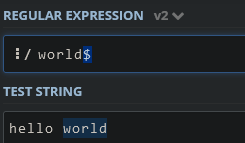
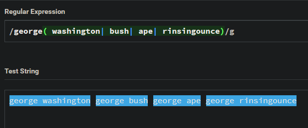

# A Guide to Rejex

What is Rejex?
Regular Expression(otherwise known as Regex) is a sequence of characters that defines a search pattern for text. Regular expressions are commonly used to search for specific sequences of characters within a string, this could be used to extract specific information from any text such as phone numbers, email adresses, dates, and so forth. The most interesting thing about regular expressions is that it can be used in almost every programming language (Javascript, Java, Python, Ruby, etc.). Ever been on a search engine like Google or Bing? They use regular expressions in their search algorithm for people to find exactly what they're looking for.

## Summary

Briefly summarize the regex you will be describing and what you will explain. Include a code snippet of the regex. Replace this text with your summary.

Let's say that you want to make specific requirements for a user's password in order for it to be strong enough to be unguessable, so you would something something like this to your code: 

/^(?=.*[A-z])(?=.*[A-Z])(?=.*[0-9])(?=.*[*_%$@])(?!.*[pPoO])\S{6,}$/

## Table of Contents

- [Anchors](#anchors)
- [Quantifiers](#quantifiers)
- [OR Operator](#or-operator)
- [Character Classes](#character-classes)
- [Flags](#flags)
- [Grouping and Capturing](#grouping-and-capturing)
- [Bracket Expressions](#bracket-expressions)
- [Greedy and Lazy Match](#greedy-and-lazy-match)
- [Boundaries](#boundaries)
- [Back-references](#back-references)
- [Look-ahead and Look-behind](#look-ahead-and-look-behind)

## Regex Components

### Anchors
Anchors are used to find specific matching words from either the begining of the sentence or the end of a sentence. 

the caret symbol (^) is used as the start anchor and it is used to match any piece of string that starts with the beginning word in a string: 

 

  

 

the dollar sign ($) is used as an ending anchor and it is used to match any piece of string that ends with the last word in the string:

 

  

 

Not typing in any specific type of anchor can locate specific pieces of text within the string:

 

  

 
Looking at this image, you can see that "there" was located in the middle of the string with no use of the "$" or "^" symbols, making it focus on finding the specific piece of text anywhere on the 

 

  

 

reminder that these expressions are case sensitive

### Quantifiers
The Quantifier element matches the following piece of text one or more times.

The star symbol (*) is used to match text within a string that has a specific piece of text with none or more 
of the last string text:

 

  

 

The plus symbol (+) finds and matches text within the string followed by one or more of the same last character:

 

  

 

The question mark (?) matches text in a string followed by either no or one of the last character in a piece of text.

 

  

 

Looking at this image, you can see that the expression still grabbed all or only a part of the strings that contained "ab" and/or "c" within the text.

The curly brackets "{}", is able to match in multiple ways:

using curly brackets with only one number inside like this can match a string that has matching string followed by the exact number of last specific piece of a matching character.

For example: the expression {4} will find any piece of string that has exactly 4 of the same last character on that said text.   

 

  

 

If you have a comma after the number within the curly brackets like this: {4, } , you are then finding the matching text as well as 4 or more of the same character.

 

  

 

looking at the image above, when using this quantifier, users can grab  more than one 

A pretty neat feature, but what happens if you add another number on the other side of the comma?

Let's try typing teen{4,6} into the expression:
 

  

 

as shown above, the expression matches the similar string with 4 or 6 of the same last character in the string.

### OR Operator

OR Operators (also known as Alternation Operators) uses a boolean format to match a string that either has one piece of text or the other. for example:  

The OR operator being used below either matches a string with either b or c using a "(|)" method 

 

  

 

Surprisingly, it is not limited to just only two slots, you can add more slots for arguments to match more strings within the text area. 

 

  

 

### Character Classes
Character Classes asks the regex engine to find one specific key character class within a string, such as numbers, letters, and many others.

The `\d` expression can detect any digit within the string.

I created a couple of sentences using numbers inside the words to see if the regex expression can detect them, with no surprise, the expression spotted the numbers with ease. this is very useful if you want people to add numbers to a password like the one on the botom part of the image.

 

  

 

The `\w` expression can find any word character within a string, both alphanumeric and underscores.

 

  

 

looking at this image, we can see it is matching ONE character as a single match, it does not match one full word.

The `\s` expression can find any blank spaces within the text.

 

  

 

Using capital letter versions of these expressions can give you the opposite effect. 

The `\D` expression can match any single character that is NOT a number(NaN).
 

  

 

### Flags

### Grouping and Capturing

### Bracket Expressions

### Greedy and Lazy Match

### Boundaries

### Back-references

### Look-ahead and Look-behind

## Author
Ethan Torres is a web developer that is learning full-stack web development through the University of Texas at Austin.

check out his github to learn more about his past projects at:
https://github.com/Ottiemobile

